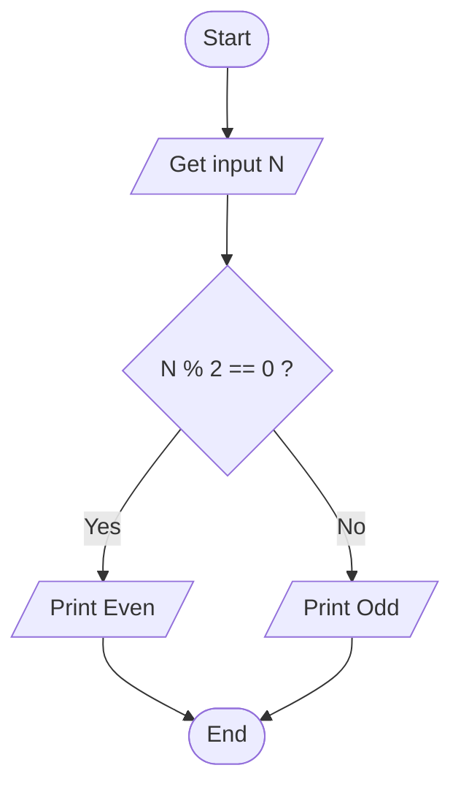
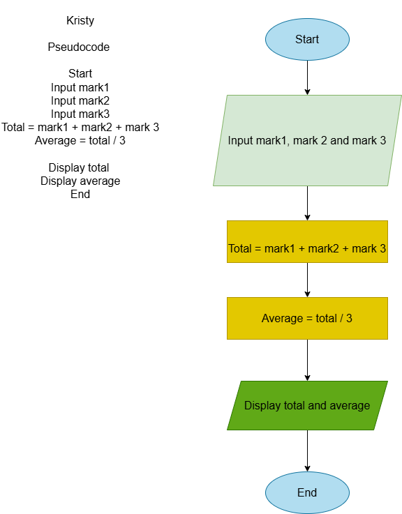
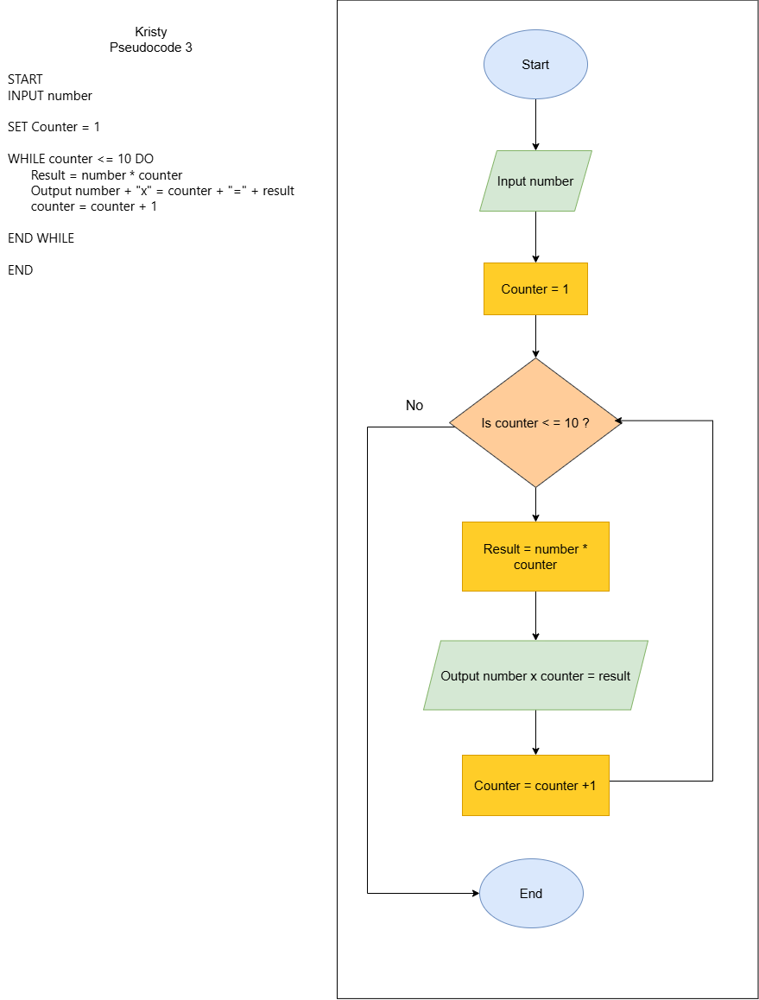
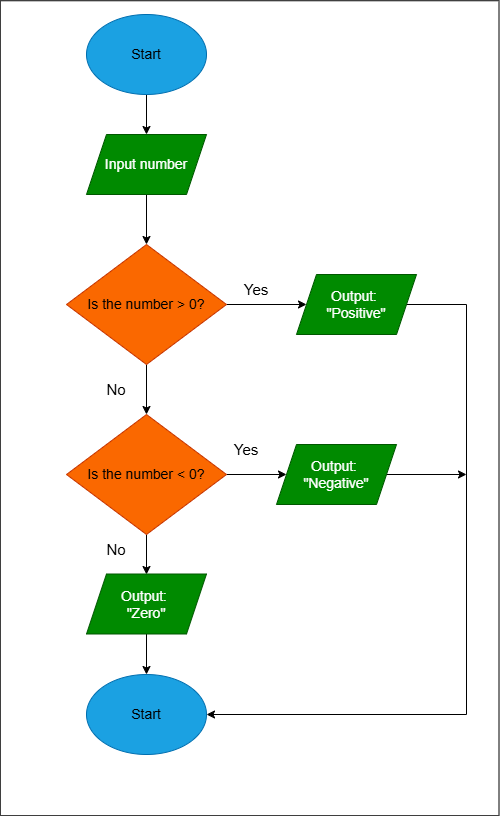
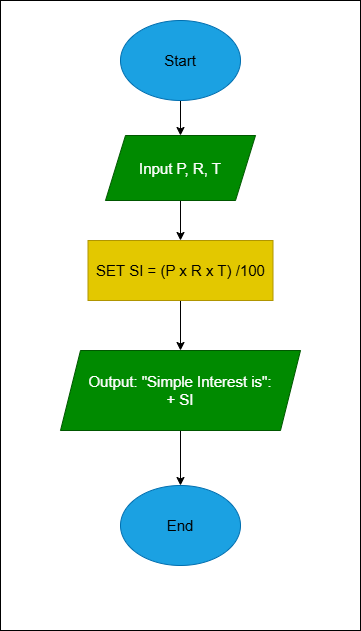
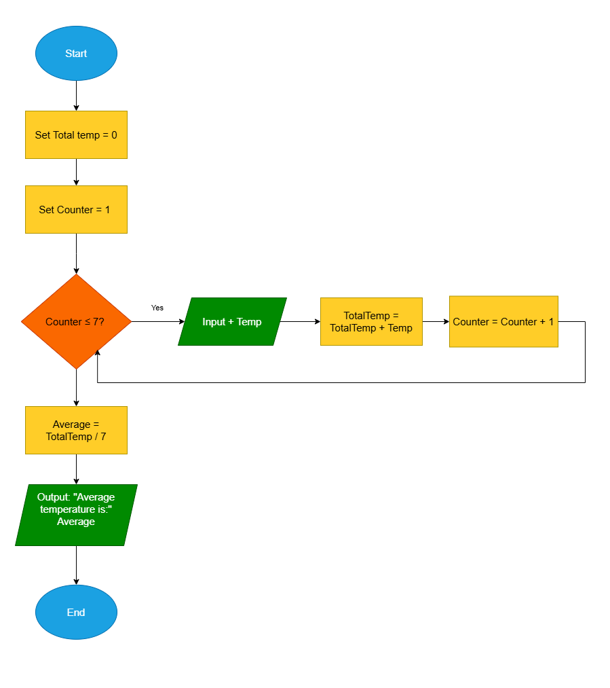
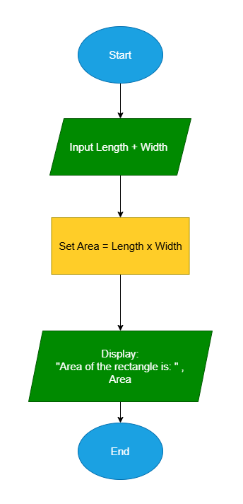
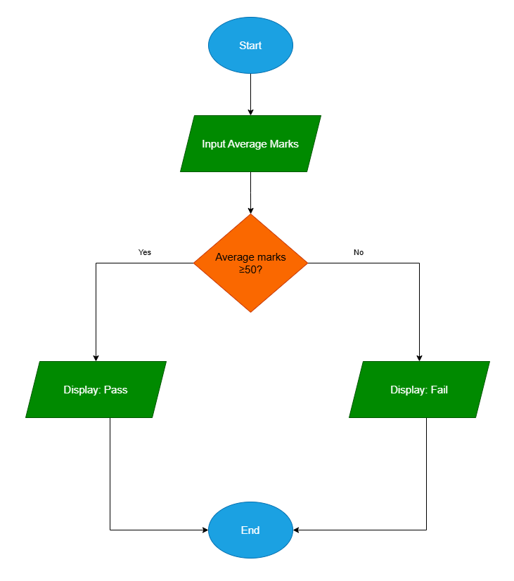
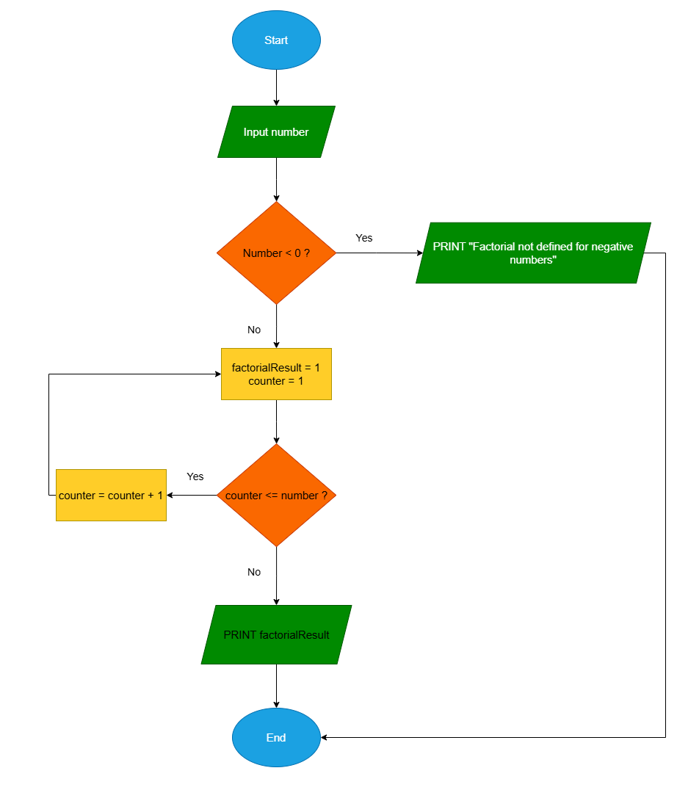
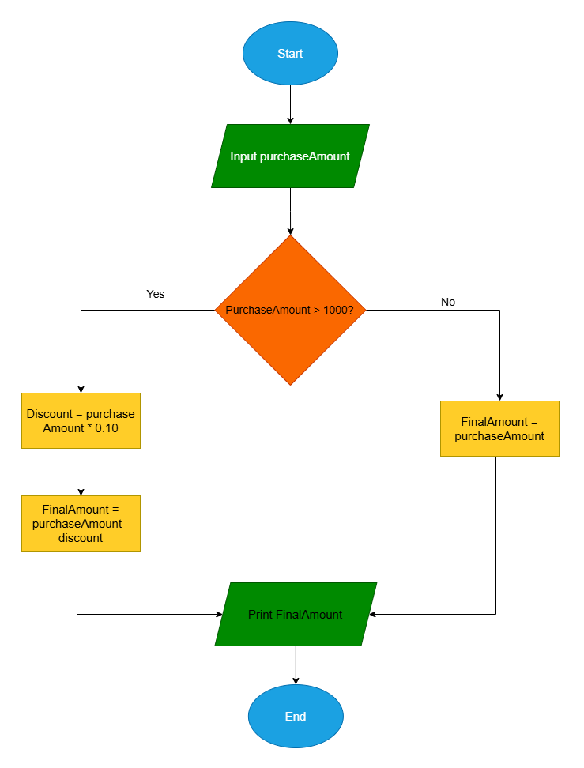

# Workshop: Algorithm and Flowchart

For each question in this workshop, you must complete **two** things:

1.  **Write the pseudocode**
2.  **Draw the flowchart** using either
    - **Option 1:** Draw.io (recommended) → export image → upload to
      your repository → link it in this file
    - **Option 2 (optional):** Write a Mermaid flowchart directly in
      Markdown
    - **Option 3 (optional):** Any other valid method

👉 **IMPORTANT:** At the **bottom of each question**, add the
following sections:

### ✔ Pseudocode

### ✔ Flowchart

---

## 1. Check Even or Odd Number

Design an algorithm and flowchart that take a number as input and
determine whether it is even or odd.

### ✔ Pseudocode

```text
START
    INPUT number
    IF number % 2 == 0 THEN
        PRINT Even
    ELSE
        PRINT Odd
    ENDIF
END
```

### ✔ Flowchart



---

## 2. Calculate Total and Average Marks

Write the algorithm and draw the flowchart for a program that inputs
marks for 3 subjects, calculates the total and average, and displays
both.

### ✔ Pseudocode
``` 
START
INPUT mark1
INPUT mark2
INPUT mark3
Total = mark1 + mark2 + mark3
Average = total / 3

DISPLAY total
DISPLAY average

END
```


### ✔ Flowchart



---

## 3. Display Multiplication Table

Create an algorithm and flowchart that input a number and display its
multiplication table from 1 to 10 using a loop.

### ✔ Pseudocode

```
START
INPUT number

SET Counter =1

WHILE counter <= 10 DO
    Result = number * counter
    OUTPUT number + "x"= counter + "=" + result
    counter = counter + 1
END WHILE

END
```


### ✔ Flowchart
 

---

## 4. Positive, Negative, or Zero Check

Write the algorithm and flowchart to input a number and display whether
it is positive, negative, or zero.

### ✔ Pseudocode

```
START
    INPUT number
    IF number > 0 THEN
        OUTPUT "Positive"
    ELSE IF number < 0 THEN
        OUTPUT "Negative"
    ELSE
        OUTPUT "Zero"
    END IF
END
```

### ✔ Flowchart

 

---

## 5. Simple Interest Calculator

Create an algorithm and flowchart for a program that calculates simple
interest using the formula:

**SI = (P × R × T) / 100**

- **P = Principal** → original amount of money
- **R = Rate of Interest** → percentage per year
- **T = Time** → number of years

### ✔ Pseudocode

```
START
    INPUT P   
    INPUT R   
    INPUT T   
    SET SI = (P * R * T) / 100
    OUTPUT "Simple Interest is: ", SI
END
```

### ✔ Flowchart

 

---

## 6. Average Temperature Calculation

Write the algorithm and draw the flowchart for a program that takes the
temperature of 7 days, finds the average temperature, and displays it.

### ✔ Pseudocode
```
START
    SET TotalTemp = 0
    SET Counter = 1

    WHILE Counter <= 7
        INPUT Temp
        TotalTemp = TotalTemp + Temp
        Counter = Counter + 1
    END WHILE

    SET Average = TotalTemp / 7
    DISPLAY "Average temperature is: ", Average
END
```

### ✔ Flowchart

 


---

## 7. Calculate Area of a Rectangle

Create an algorithm and flowchart to input length and width, calculate
the area (**Area = Length × Width**), and display the result.

### ✔ Pseudocode

```
START
    INPUT Length
    INPUT Width
    SET Area = Length * Width
    DISPLAY "Area of the rectangle is: ", Area
END
``` 

### ✔ Flowchart

 


---

## 8. Determine Pass or Fail

Write the algorithm and draw the flowchart for a program that takes a
student's average marks and displays **"Pass"** if average ≥ 50,
otherwise **"Fail"**.

### ✔ Pseudocode

```START
    INPUT AverageMarks
    IF AverageMarks >= 50 THEN
        DISPLAY "Pass"
    ELSE
        DISPLAY "Fail"
    END IF
END
```

### ✔ Flowchart

 


---

## 9. Calculate Factorial of a Number

Write the algorithm and draw the flowchart that input a number and
calculate its factorial using a loop.

### ✔ Pseudocode

```
START
    INPUT number
    SET FactorialResult = 1
    SET counter = 1

    WHILE counter <= number DO
        factorialResult = factorialResult * counter
        counter = counter + 1
    END WHILE

    PRINT factorialResult
END
``` 

### ✔ Flowchart

 
---

## 10. Calculate Discount on Purchase

Write the algorithm and draw the flowchart for a program that inputs the
purchase amount and gives a **10% discount** if the amount is greater
than 1000.

### ✔ Pseudocode

```
START
    INPUT purchaseAmount

    IF purchaseAmount > 1000 THEN
        discount = purchaseAmount * 0.10
        finalAmount = purchaseAmount - discount
    ELSE
        finalAmount = purchaseAmount
    END IF

    PRINT finalAmount
END
```

### ✔ Flowchart

 

---
